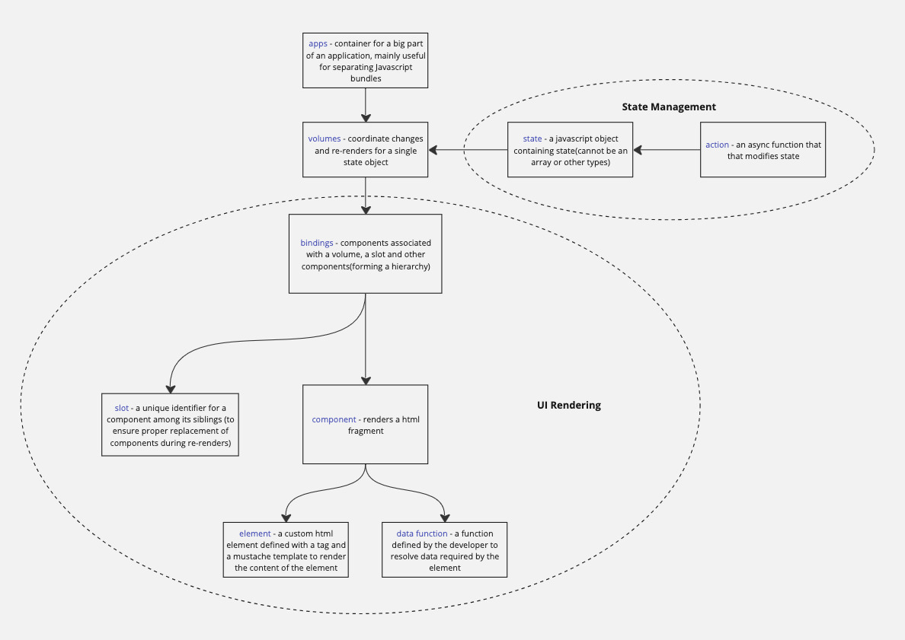

# React-slim

Super small react-redux implementation (~127 lines)

I like to think of it as the unshitification of react :)

The main motivation to write this library was the shock and horror I felt when I noticed that
the react library actually has a compiler and rust code that compiles to WASM etc. making me
wonder why such a complex implementation was needed for such a simple design pattern.

# What you get with this library

- Simple, understandable code that provides all of the core advantages of using the react design pattern
  - Component updation on declared state changes
  - Action dispatches which trigger state changes, which in turn trigger component updates
- Component heirarchies that update efficiently without duplication and unnecessary re-renders
- State need not be immutable
- Modular structure that allows you to break up your app into multiple sub-apps
- Flexible, de-coupled implementation that allows you to combine things the way you want to
- Great performance

# What you don't get with this library

- Magic - no hidden functionality, no side-effects => no surprises or unpredictable behavior
- Bells and whistles - only one way to work with the library => no confusions
- developer "protection" - no parameter checking or safety checks => fast, tiny codebase

# Understanding react-slim

The following diagram describes how react-slim is organized

An example usage of react-slim to create a simple app that demonstrates how to use react-slim
is included in the repository, you can see it here

# Opinionated/polarizing design choices

Here are some polarizing design choices I've made in the library. These are points you should
seriously consider before adopting react-slim for large applications.

ChatGPT pointed out to me that state propagation across volumes is a disadvantage and suggested
centralized state management as an option. I decided to go against its suggestion because multiple volume
state changes can easily be triggered by two or more actions on two or more different volumes.
React-slim makes a trade-off on centralized state management and shoots for modular state because
centralized state management involves complexities in desiging the state for large applications.

ChatGPT also pointed out that I don't use a virtual DOM for efficient updates to the UI, but on
researching this topic, again, I found it unnecessary since react-slim only updates components whose state
has changed, unlike React which re-renders the entire DOM tree on every state update.

# How this library will evolve

I don't plan to change the functionality of the library *at all*. I think the world has too
many libraries that change too fast, leaving developers always confused about the right way
to build apps or features.

I am, however, open to performance improvements and bug-fixes

# Author

Mahadevan K - mahadevan.k@gmail.com
